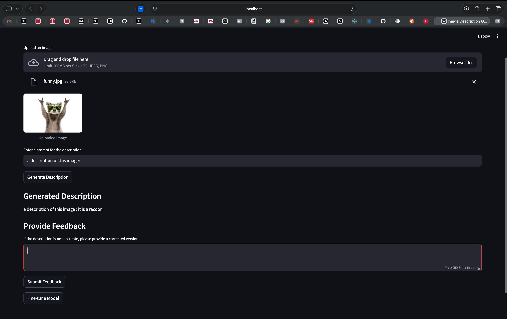
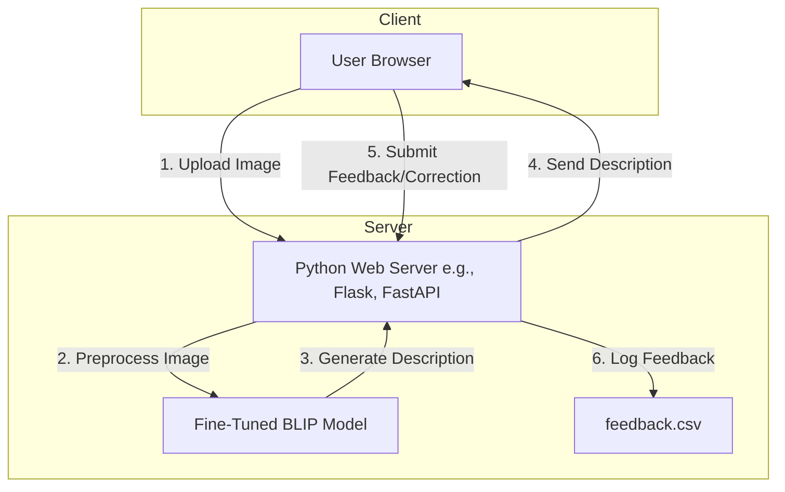

# Image Description Generator

This application uses a deep learning model to generate a description of an uploaded image. Users can also provide feedback to fine-tune the model.

## Screenshot



## Setup

To set up and run this application, follow these steps:

1.  **Create and activate a virtual environment** (recommended):
    
    ```sh
    python -m venv venv
    source venv/bin/activate  # On Windows, use `venv\Scripts\activate`
    ```

2.  **Install the required dependencies**:
    
    ```sh
    pip install -r requirements.txt
    ```

## Usage

To run the application, use the following command:

```bash
streamlit run app.py
```

## Running Requirements

*   **Python**: Version 3.8 or higher.
*   **Memory (RAM)**: At least 8 GB of RAM is recommended, as the model can be memory-intensive.
*   **Storage**: At least 2 GB of free disk space is required for the model and its dependencies.
*   **Internet Connection**: An internet connection is required to download the pre-trained model on the first run.

## ⚠️ Important Considerations

Before you begin, please be aware of the following:

*   **Model Size**: The fine-tuned model is approximately **800 MB**. Please be patient when cloning the repository or downloading the model for the first time.
*   **Model Accuracy**: This model was fine-tuned on a very limited dataset consisting only of raccoon images. As a result, its accuracy is quite low, and it will likely fail to generate correct descriptions for most images. The `feedback.csv` file highlights these inaccuracies. The primary purpose of this project is to demonstrate the architecture and the feedback loop, not to provide a production-ready service.
*   **Resource Consumption**: Running this model is resource-intensive. It requires a significant amount of system memory (RAM) to load and perform inference. Ensure your machine has sufficient resources available before running the application.

## Architecture

The project follows a client-server architecture where a web-based frontend communicates with a Python backend that hosts the machine learning model.



### Components

*   **Client (User Browser)**: A simple web interface that allows a user to upload an image file and view the model-generated description. It also provides a way for the user to submit a corrected description.
*   **Python Web Server**: A backend server responsible for handling HTTP requests from the client. It manages image data, interacts with the ML model, and logs user feedback.
*   **Fine-Tuned BLIP Model**: The core of the project. This is a `BlipForConditionalGeneration` model, as specified in the `fine-tuned-model/config.json`. It takes an image as input and generates a text description.
*   **feedback.csv**: A simple CSV file that acts as a database to store the original image, the model's generated description, and the user's feedback. This data is invaluable for analyzing model performance and for future retraining cycles.

## How it Works

The workflow is a straightforward process involving image upload, model inference, and a feedback loop.

1.  **Image Upload**: The process begins when a user selects an image from their local machine and uploads it through the web frontend. The browser sends the image data to the backend server.

2.  **Inference Request**: The Python backend receives the image. It preprocesses the image to match the input requirements of the vision model (e.g., resizing to 384x384 pixels, as defined in `vision_config`).

3.  **Description Generation**: The preprocessed image tensor is passed to the fine-tuned BLIP model. The model, which combines a vision transformer and a text decoder, performs inference to generate a descriptive caption for the image.

4.  **Displaying the Result**: The backend server sends the generated text description back to the client's browser, where it is displayed to the user.

5.  **User Feedback**: The user reviews the generated description. If it's inaccurate or incomplete, they can type a correction into a feedback form. The `feedback.csv` file shows examples of this, such as correcting "racco" to "It is a raccoon."

6.  **Logging for Improvement**: When the user submits the feedback, the frontend sends the corrected text to the backend. The backend then appends a new row to `feedback.csv`, recording the image identifier, the model's original (and incorrect) output, and the user's superior description. This creates a valuable dataset that can be used to further fine-tune the model and improve its accuracy over time.

### A Note on the `ImportError`

The `feedback.csv` file contains an entry with an `ImportError: cannot import name 'AdamW' from 'transformers'`. This suggests a runtime issue in the backend, likely related to an outdated version of the `transformers` library or a dependency mismatch. `AdamW` was moved from the top-level `transformers` package to `transformers.optimization`.

To fix this, you should update the import statement in your training or inference script.

**Example Code Fix:**

```diff
--- a/your_script.py
+++ b/your_script.py
@@ -1,4 +1,4 @@
- from transformers import AdamW
+ from transformers.optimization import AdamW
  # ... other imports

```

Ensuring your environment is correctly configured is crucial for the model to run as expected.